# ft_irc 아키텍처 / 전체 흐름 정리

이 문서는 `ft_irc` 코드베이스를 기준으로,
서버의 **전체 구조**, **런타임 흐름**, **클래스 책임 분리**, **명령 처리 경로**를
한눈에 파악할 수 있도록 정리한 아키텍처 문서다.

기준 파일:
- `srcs/Server.cpp`
- `srcs/IrcCore.cpp`
- `srcs/IrcCoreRegistration.cpp`
- `srcs/IrcCoreProtocol.cpp`
- `srcs/IrcCoreChannel.cpp`
- `srcs/IrcCoreSupport.cpp`
- `srcs/ClientRegistry.cpp`
- `srcs/ChannelRegistry.cpp`
- `srcs/IrcParser.cpp`
- `srcs/IrcMessageBuilder.cpp`

---

## 1. 한 줄 요약

이 서버는 크게 아래 네 계층으로 구성된다.

1. **Server**
   - 소켓 생성
   - `poll()` 이벤트 루프 관리
   - accept / recv / send / close 담당
   - 실제 네트워크 I/O 실행 주체

2. **IrcCore**
   - IRC line 파싱 결과를 해석
   - 등록 상태 확인
   - 권한 / 채널 규칙 / 명령 처리
   - 직접 `send()` 하지 않고 `ServerAction`만 생성

3. **Registry 계층**
   - `ClientRegistry`: 클라이언트 상태 저장
   - `ChannelRegistry`: 채널 상태 저장

4. **Protocol 보조 계층**
   - `IrcParser`: raw line → `IrcCommand`
   - `IrcMessageBuilder`: numeric / command 메시지 직렬화

전체 구조를 요약하면

> **Transport(Server) / Domain(IrcCore) / State(Registry) / Protocol(Parser, Builder)**

형태로 나뉜 구조다.

---

## 2. 최상위 아키텍처

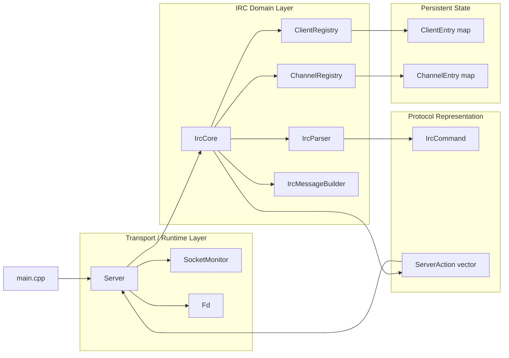

### 해석

- `main.cpp`는 프로그램 진입점과 초기 실행 흐름을 담당한다.
- `Server`가 중심 런타임이다.
- `IrcCore`는 도메인 규칙 담당이다.
- `ClientRegistry`, `ChannelRegistry`는 상태 저장소다.
- `IrcParser`, `IrcMessageBuilder`는 wire format 입출력 보조다.
- `IrcCore`는 네트워크 호출 대신 `ServerAction`을 만든다.
- `Server`가 그 action을 실제 I/O로 실행한다.

이 구조가 전체 데이터 흐름의 기준이 된다.

---

## 3. 주요 파일 책임 맵

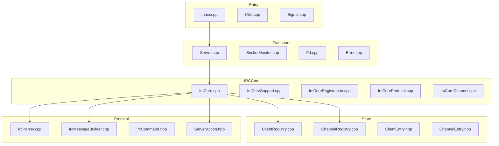

### 파일 역할 요약

| 구역 | 핵심 파일 | 역할 |
|---|---|---|
| Entry | `main.cpp` | 인자 검사 후 `Server` 실행 |
| Runtime | `Server.cpp` | socket/poll/accept/read/write/close |
| Runtime | `SocketMonitor.cpp` | `pollfd` 목록 관리 |
| Runtime | `Fd.cpp` | listen fd 래퍼 |
| State | `ClientRegistry.cpp` | 클라이언트 등록/닉/유저/버퍼 상태 |
| State | `ChannelRegistry.cpp` | 채널 멤버/오퍼레이터/mode/topic 상태 |
| Domain | `IrcCore*.cpp` | IRC 명령 처리 로직 |
| Protocol | `IrcParser.cpp` | line 파싱 |
| Protocol | `IrcMessageBuilder.cpp` | reply/message 생성 |
| Action | `ServerAction.hpp` | Core → Server 작업 요청 |

---

## 4. 서버 시작 흐름

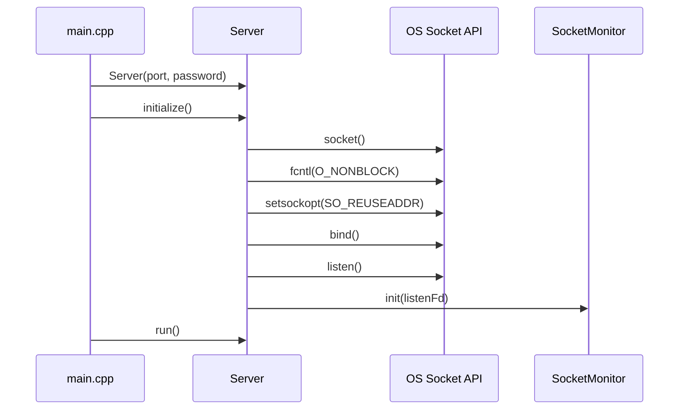

### 포인트

- listening socket을 만들고 바로 non-blocking으로 바꾼다.
- `SocketMonitor`에 listen fd를 등록한다.
- 이후 `run()`에서 이벤트 루프가 시작된다.

---

## 5. 런타임 이벤트 루프

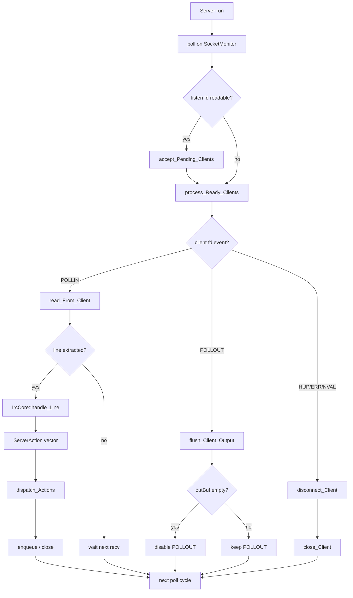

### 해석

이 구조의 핵심은 다음 두 가지다.

1. **입력은 누적 버퍼 기반**
   - `recv()` 한 번에 명령 하나가 온다고 가정하지 않는다.
   - `inBuf`에 누적한 뒤 줄 단위로 뽑는다.

2. **출력은 큐 기반**
   - `send()`를 즉시 호출하는 구조가 아니라 `outBuf`에 쌓는다.
   - `POLLOUT` 준비가 되었을 때만 밀어낸다.

즉, 이 서버는 입력과 출력을 분리한
**non-blocking buffered I/O** 구조로 동작한다.

---

## 6. 입력 처리 세부 흐름

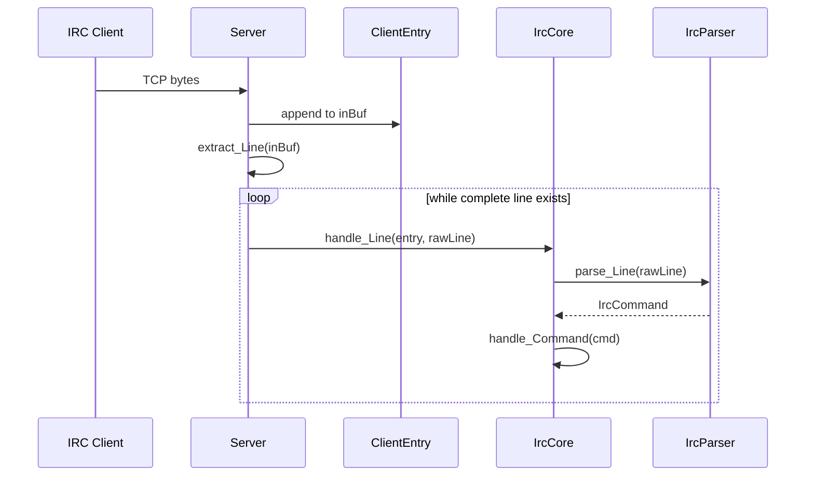

### 여기서 중요한 데이터

`ClientEntry` 안에 transport + registration state가 같이 들어 있다.

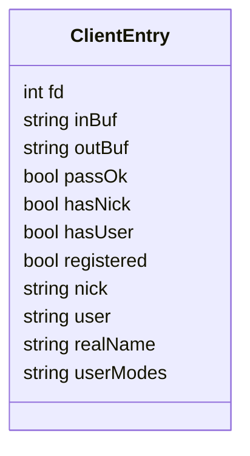

### 의미

- `inBuf`, `outBuf`는 transport 상태
- `passOk`, `hasNick`, `hasUser`, `registered`는 등록 상태
- `nick`, `user`, `realName`, `userModes`는 IRC 사용자 상태

이 프로젝트는 해당 상태들을 `ClientEntry` 하나에서 함께 관리한다.

---

## 7. Core 명령 처리 구조

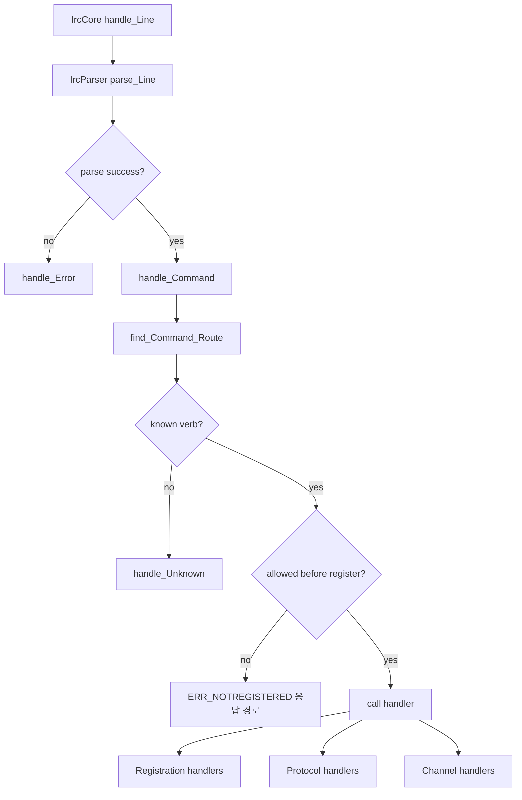

### 실제 핸들러 분리

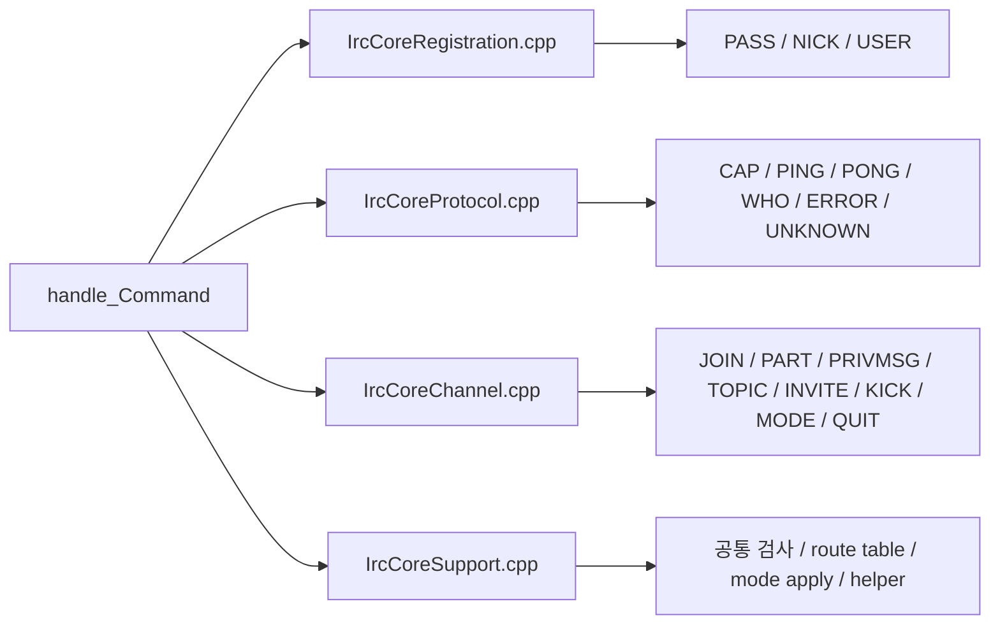

### 구조적으로 보면

- `IrcCore.cpp`는 진입점 / action push / 공통 송신 헬퍼
- `IrcCoreRegistration.cpp`는 등록 단계 명령
- `IrcCoreProtocol.cpp`는 보조 프로토콜
- `IrcCoreChannel.cpp`는 채널/메시징 명령
- `IrcCoreSupport.cpp`는 공통 검사와 helper

즉, 도메인 로직은 `IrcCore`를 중심으로 두고,
**구현 파일 단위로 역할을 나누어** 관리한다.

---

## 8. 등록(Registration) 흐름

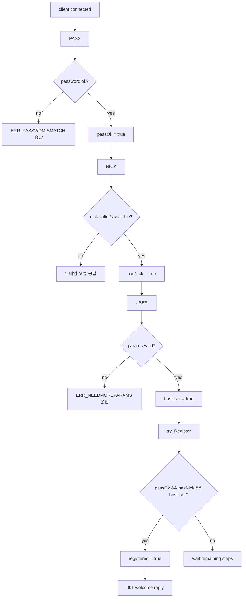

### 이 코드의 특징

- `PASS`를 먼저 받아야 `NICK`, `USER`가 허용되는 구조다.
- 등록 완료 여부는 `try_Register()`에서 한 번 더 확인한다.

---

## 9. 채널 상태 구조

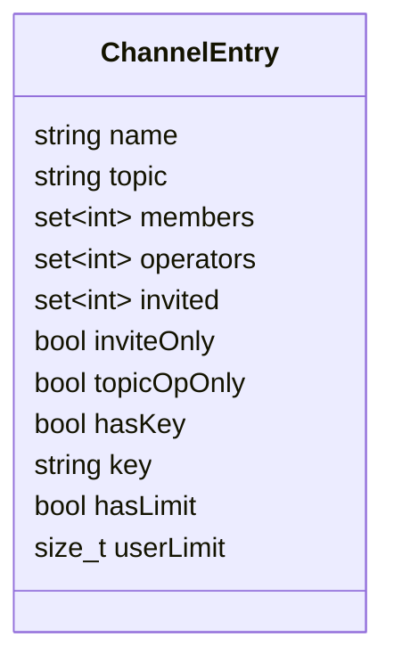

### 의미

- `members`: 채널 참가자
- `operators`: 채널 op
- `invited`: 초대 대상
- `inviteOnly`: `+i`
- `topicOpOnly`: `+t`
- `hasKey/key`: `+k`
- `hasLimit/userLimit`: `+l`

채널 정보는 전부 `ChannelRegistry`의
`map<string, ChannelEntry>` 안에서 관리된다.

---

## 10. JOIN / PRIVMSG / TOPIC / MODE 흐름

### 10-1. JOIN

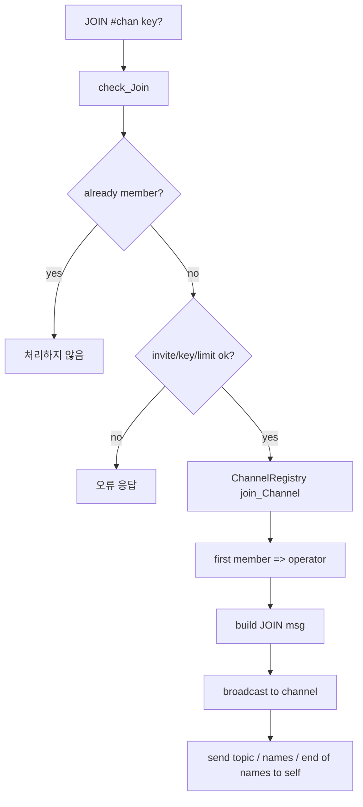

### 10-2. PRIVMSG

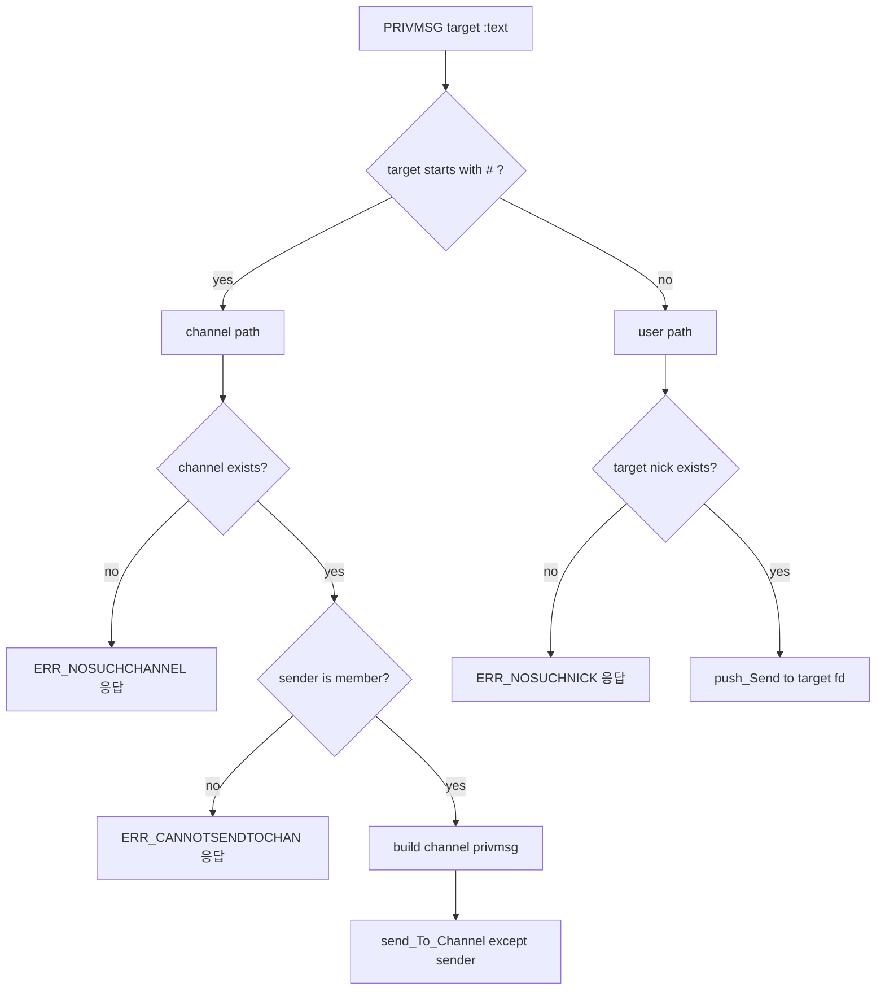

### 10-3. TOPIC

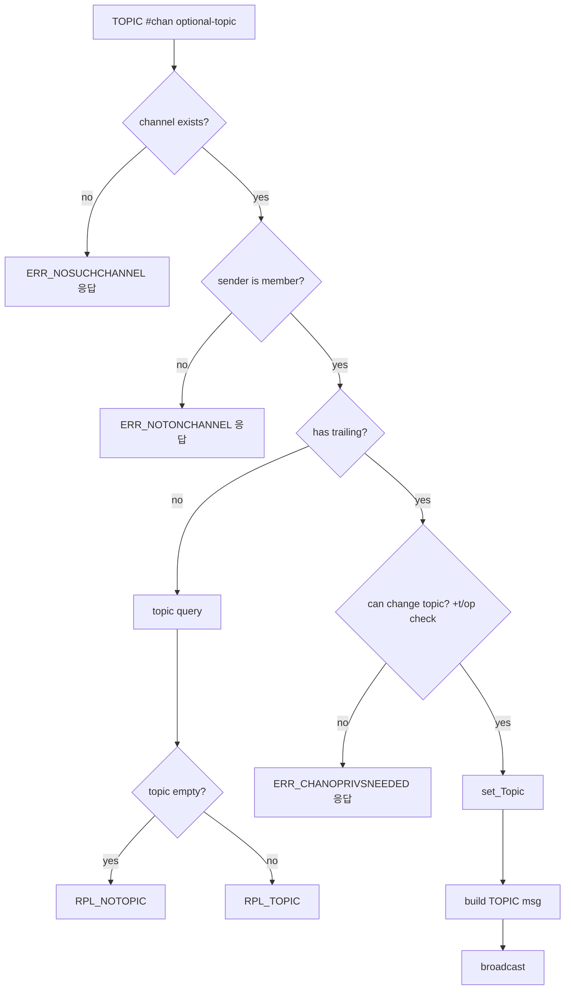

### 10-4. MODE

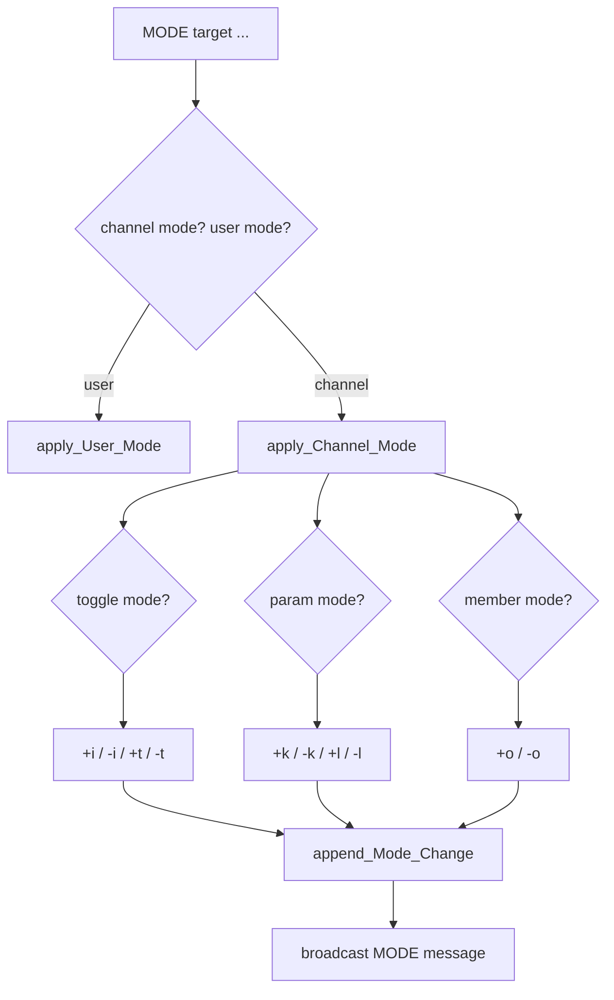

---

## 11. 메시지 생성과 전송 분리

이 코드의 중요한 설계 포인트 중 하나는
`IrcCore`가 직접 socket I/O를 하지 않는다는 점이다.

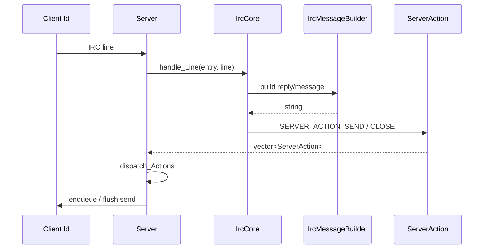

### 의미

- `IrcCore`는 도메인 규칙 담당
- `Server`는 실행 담당
- `IrcCore`는 소켓 계층과 직접 결합하지 않고 명령 처리에 집중한다

이 지점에서 네트워크 처리와 명령 처리의 책임이 분리된다.

---

## 12. 출력 버퍼 구조

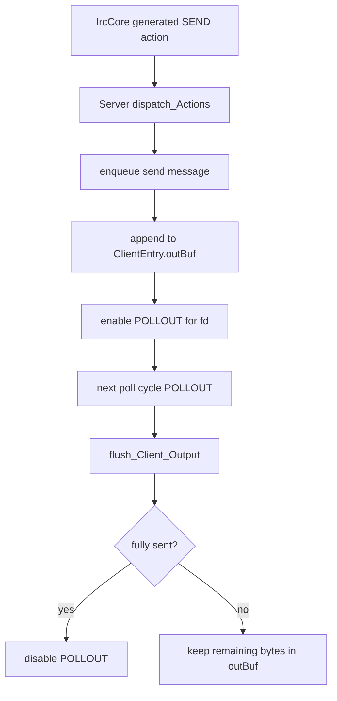

### 핵심

- 느린 클라이언트도 바로 서버를 멈추게 하지 않는다.
- 쓰기 준비 시점에만 실제 송신한다.
- `MAX_OUTBUF`를 넘기면 해당 클라이언트를 끊는 보호 로직도 있다.

---

## 13. Disconnect / QUIT 흐름

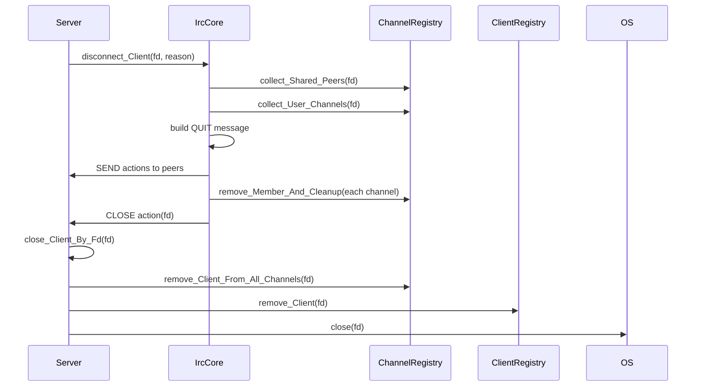

### 정리 흐름

- `IrcCore`는 IRC 관점에서 `QUIT` message와 채널 탈퇴 처리를 준비한다.
- `Server`는 실제 fd close와 registry 정리를 수행한다.

이 흐름은 명령 처리 결과와 실제 소켓 종료를 분리하기 위한 구조다.

---

## 14. Registry 중심 데이터 흐름

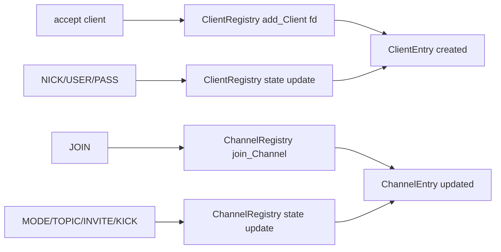

### 정리

서버의 주요 상태는
Registry 계층에서 관리된다.

- `Server`: 런타임 제어
- `IrcCore`: 상태를 읽고 쓰는 규칙 엔진
- `Registry`: 실제 데이터 저장소

즉, 상태 중심으로 보면
`ClientRegistry`, `ChannelRegistry`가 서버 상태 저장 계층이다.

---

## 15. 코드 읽기 추천 순서

이 프로젝트를 처음부터 읽는다면 다음 순서가 자연스럽다.

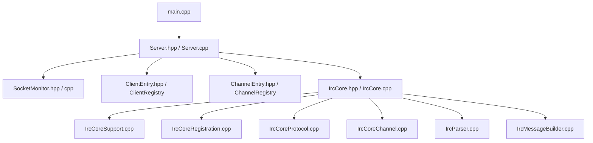

### 이유

- 먼저 **런타임 축(Server)** 을 보면 전체 데이터 흐름을 잡기 쉽다.
- 그 다음 **상태 저장소(Registry)** 를 봐야 도메인 로직이 이해된다.
- 마지막에 **Core / Parser / Builder** 를 보면 명령 처리 전체가 연결된다.

---

## 16. 최종 요약

전체 파이프라인은 아래와 같이 정리할 수 있다.

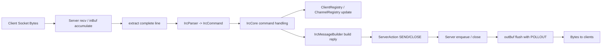

즉,

> **입력 바이트 → 라인 파싱 → 명령 해석 → 상태 변경 → 메시지 생성 → action 반환 → 실제 송신**

이 흐름이 서버의 전체 파이프라인이다.
